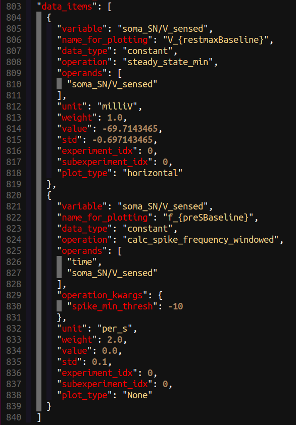
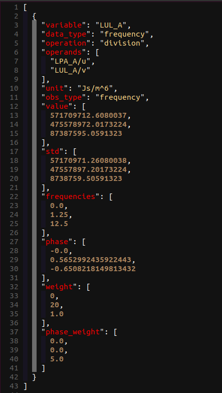
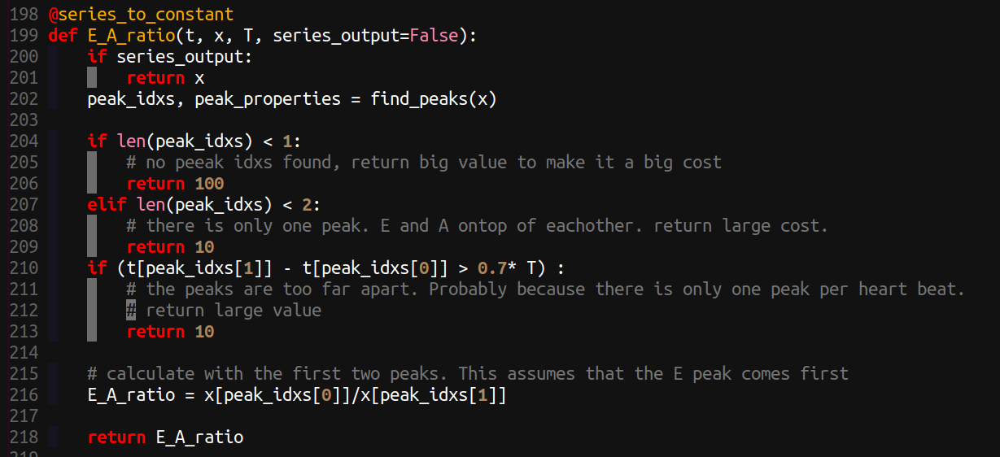

# Parameter Identification

The parameter identification part of Circulatory_Autogen is designed to allow calibration of a model to experimental or clinical data. It implements an optimisation method to find the best fit parameters that give a minimal (local minima) error difference between the model output and the ground truth observables (experimental or clinical data or user specified). The creation of below two configuration files is necessary: 

- **params_for_id**
- **param id observables**

Those files should be added to the `[CA_dir]/resources` directory. Proper names of the files are **[file_prefix]_params_for_id.csv** and **[file_prefix]_obs_data.json**, respectively.

## Creating params_for_id file

This file defines which parameters (constants and initial_states) within your model that you will vary in the parameter id process and their allowed ranges (prior distribution). Following is an example of the `params_for_id.csv` file.


The entries in the file are detailed as follows:

- **vessel_name**: the name of the vessel/module the parameter is in
- **param_name**: the name of the parameter in the cellml module (not including the "vessel_name" suffix that is included in the `[file_prefix]_parameters.csv` file).
- **param_type**: **"state"** or **"const"**; whether the parameter is the initial value of a state or a const. 
- **min**: The minimimum of the range of possible values (min of the uniform distribution).
- **max**: The maximum of the range of possible values (max of the uniform distribution).
- **name_for_plotting**: The name (latex format) that will be used when automatically potting comparisons with observables and predictions.

!!! Note
    **param_type** will be deprecated. All should be **"const"**. Initial values that need to identified should be defined as constants within the cellml module.

!!! info
    In the future we plan on including other types of priors rather than just uniform.

## Creating param id observables file

This file defines the simulation protocol (protocol_info), and ground truth observables that will be used in the cost function for the parameter id optimisation algorithm. It also defines the measurement standard deviation, and weighting for each observable.

File path of the obs_data.json file should be defined as **param_id_obs_path** in `[CA_dir]/user_run_files/user_inputs.yaml`.

!!! Note
    IMPORTANT: For creating obs_data.json files in python (strongly recommended over modifying the json by hand
    you can use the helper class in `src/utilities/obs_data_helpers.py`. See `src/scripts/example_format_obs_data_json_file.py` for an example 
    that you can copy and change for your parameter identification task.

# protocol info

The protocol info defines the numerical experiments you will be running. Here is an example for a sympathetic neuron calibration where the input current is changed
from 0 to 0.15 pA after 1 second then simulated for 2 seconds with that input current. This was performed in two experiments, the first experiment with a M-type potassium conductance of 0.08 uS and the second experiment with an increased M-type potassium channel conductance of 0.12 uS.


For the protocol we define each experiment as each new full simulation that needs to be run. Each subexperiment is a section of an experiment 
with its own set of parameters. Subexperiments generally relate to different time periods where the inputs in the experiments that are being used for 
calibration have a change in value (e.g. change in drug concentration, change in stimulatiion frequency, change in applied force). The entries in the protocol info are:

- **pre_times**: The amount of simulation that is done before you want to compare to observables or plot (this part of the simulation is thrown away. This
is mainly used to simulate for an amout of time to reach steady state or periodic state. shape = (number of experiments)
- **sim_times**: The length in time of each subexperiment. shape=(number of experiments, number of subexperiments) -- Note: the shape isn't completely correct here, the number of subexperiments can be different for each experiment
- **params_to_change**: A dictionary where the key is a parameter name and the entry is the assigned value of that parameter in each (experiment_idx, subexperiment_idx).
- **experiment_colors**: The line color for the plots of each experiment. 
- **experiment_labels**: The label for each experiment, which is used for plotting and naming plots.

# data items.
Examples of `obs_data.json`, `data_item` entries are shown in below figures for constant, constant with operation_kwargs, series, and frequency data types, respectively. 






The entries in the data_item list in the `obs_data.json` file are:

- **variable**: This is the user defined observable name, it does not need to link to the cellml variable name.
- **data_type**: The format of the data. This can be *"constant"*, *"series"*, or *"frequency"* as shown above.
- **unit**: The unit of the observable.
- **name_for_plotting**: The name that will be in the automated plots comparing observable data to model output. (latex format)
- **weight**: The weighting to put on this observables entry in the cost function. Default should be 1.0
- **std**: The standard deviation which is used in the cost function. The cost function is the relative absolute error (AE) or mean squared error (MRE), each normalised by the std.
- **value**: The value of the ground truth, either a scalar for constant data_type, or a list of values for series or frequency data_types.
- **obs_dt**: not needed or set to "null" for constant and frequency data_types. It defines the dt for the observable series values.
Not to be confused with the dt for the model simulation outputs.
- **operation**: This defines the operation that will be done on the operands/variable. The possible operations to be done on model outputs are defined in `[CA_dir]/src/param_id/operation_funcs.py` and in `[CA_dir]/operation_funcs_user/operation_funcs_user.py` for user defined operations.
- **operation_kwargs**: This is a dictionary of key word arguments (kwargs) and their values that links to the kwargs in the chosen python operation function.
- **operands**: The above defined "operation" can take in multiple variables. If operands is defined, then the "variable" entry will be a placeholder name for the calculated variable and the operands will define the model variables that are used to calculate the final feature that will be compared to the observable value entry/s.

!!! warning
    **obs_type**: This has been deprecated in favor of the **operation** entry.

## Creating your own operations

To enable flexibility we allow you to create your own user-defined operation functions in python to extract features from your model outputs and compare to data in the calibration.
Available operation functions can be found in `src/param_id/operation_funcs.py` and in the file made for adding your own operation functions in `funcs_user/operation_funcs_user.py`.
Here is an example of an operation function for calculating the ratio of the two peaks (used for mitral valve flow).



Note:

- kwargs can be used and defined for each entry in your obs_data.json with `operation_kwargs`, see above.
- `if series_output` is needed to return the variable trace for plotting.
- A more elegant method of returning a high cost if the observable can't be calculated is being discussed.
    

## Creating your own cost functions

To allow even more flexibility, we also allow users to define their own cost functions (or likelihood functions). These can be found at `funcs_user/cost_funcs_user.py`.
An example for the maximum likelihood estimator for gaussian noise (equivalent to weighted mean squared error) is:


Note:

- Currently there are no kwargs for user defined cost functions. But there will be: see [issue](https://github.com/FinbarArgus/circulatory_autogen/issues/84)


## Parameter Identification Settings

To run the parameter identification we need to set a few entries in the `[CA_dir]/user_run_files/user_inputs.yaml file`:

- **param_id_method**: this defines the optimisation method we use. Currently this can only be genetic_algorithm, but more methods are being implemented. Eventually we aim to use CVODES to allow for gradient based optimisation methods.
- **pre_time**: this is the amount of time the simulation is run to get to steady state before comparing to the observables from `obs_data.json`. IMPORTANT: THis is overwritten by the pre_times within the obs_data.json file, see the next section.
- **sim_time**: The amount of time used to compare simulation output and observable data. This should be equal to the length of a series observable entry divided by the "sample_rate". If not, only up to the minimum length of observable data and modelled data will be compared. 
- **maximum_step**: The maximum time step for the CVODE solver
- **dt**: The output time step (This hasn't been tested well for anything but 0.01 s currently)
- **param_id_obs_path**: the path to the `obs_data.json` file described above.
- **ga_options**:
	- **cost_type**: "AE" or "MSE" for absolute error or mean squared error.
	- **num_calls_to_function**: How many forward simulations of pre_time+sim_time will be run in the optimisation algorithm.
	- **cost_convergence**: If the cost value is lower than this threshold then the calibration run is complete.
	- **max_patience**: If the cost doesn't improve for this number of simulations, then calibration is complete (we assume that the cost has converged to the global minima or can't get out of a local minima).
  - Note: In the future entries to ga_options will be kwargs that are used in the underlying user defined optimisation schemes (see [link](https://github.com/FinbarArgus/circulatory_autogen/issues/79))


## Running parameter identification

After creating the params_for_id file and the param id observables file, and configuring the above settings, run the parameter identification using the below command.

```
./run_param_id.sh
```

Following a successful parameter id process, the model with updated parameters can be generated with:

```
./run_autogeneration_with_id_params.sh
```

!!! Note
    IMPORTANT: After running the calibration, you should plot the simulation outputs vs the ground truth to analyse the fits!! This can be done with:

    ```
      ./plot_param_id.sh
    ```

    The generated models will be saved in `generated_models/` directory and plots will be saved in `param_id_outputs/` directory.
